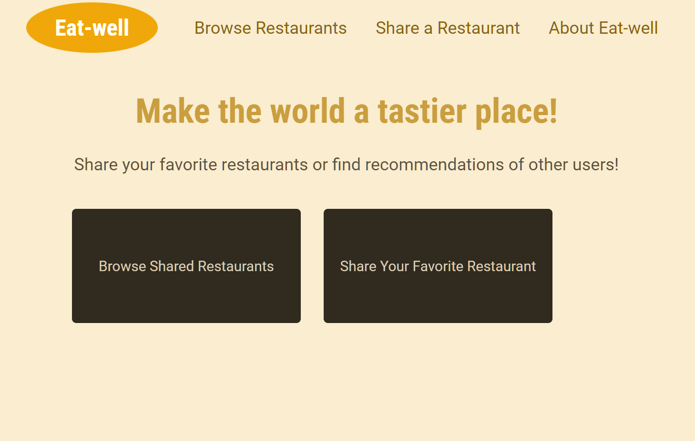

 # Restaurant Recommendation App

This Node.js Express app allows users to view a list of restaurants, recommend new restaurants, and view a confirmation page after submitting a recommendation.

## Prerequisites

- Node.js and npm installed

## Installation

Clone the repository:

```
git clone https://github.com/jubayerasif/Restaurant_Recommendation_App.git
```

Install the dependencies:

```
npm install
```

## Running the App

To run the app, use the following command:

```
npm start
```

## Usage

To use the app, visit the following URLs:

* http://localhost:3000/ - Home page
* http://localhost:3000/restaurants - List of restaurants
* http://localhost:3000/recommend - Add a new restaurant
* http://localhost:3000/confirm - Confirmation page
* http://localhost:3000/about - About page

## Code Overview

### 1. App Setup

The app is set up using Express, a popular Node.js framework for building web applications.

```javascript
const express = require("express");
const app = express();
```

### 2. View Engine

The app uses EJS as the view engine. EJS is a simple templating language that allows you to embed JavaScript code in HTML templates.

```javascript
app.set("views", path.join(__dirname, "views"));
app.set("view engine", "ejs");
```

### 3. Static Files

The app serves static files, such as CSS and JavaScript, from the `public` directory.

```javascript
app.use(express.static("public"));
```

### 4. Body Parser

The app uses the `express.urlencoded` middleware to parse request bodies in the `application/x-www-form-urlencoded` format.

```javascript
app.use(express.urlencoded({ extended: false }));
```

### 5. Routes

The app defines several routes, each handling a different request.

#### 5.1 Home Page

The home page route simply renders the `index.ejs` template.

```javascript
app.get("/", function (req, res) {
  res.render("index");
});
```

#### 5.2 Restaurants Page

The restaurants page route fetches a list of restaurants from a JSON file, renders the `restaurants.ejs` template, and passes the number of restaurants and the list of restaurants to the template.

```javascript
app.get("/restaurants", function (req, res) {
  const filePath = path.join(__dirname, "data", "restaurants.json");

  const fileData = fs.readFileSync(filePath);
  const storedRestaurants = JSON.parse(fileData);
```
### Author
```
Jubayer Hasan Asif
```